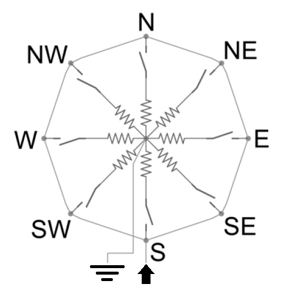

# Sensor Name

Here is the wind vane sensor supplied with the Raspberry Pi Weather Station kit


## How does it work?
A wind vane shows the direction *from which* the wind is coming, not where it's going (this can be confusing because TV weather maps show the opposite). It works by the wind exerting force on a vertical blade which rotates to find the position of least resistance, this position is then aligned with the direction of the oncoming wind.

The wind vane is the more complex than the [rain gauge](rain.md) or [anemometer](anemometer.md). It does use reed switches and magnets but it works in a completely different way. Let's look inside the wind vane to see:

1. Pull the top off the wind vane, it should come off without much force. On the underside you'll again find the metal cylinder which is the magnet.


Next take the screwdriver and remove the three screws in the base, slide the base panel down the cable a bit to get it out of the way. If you look inside now you'll see there are eight reed switches arranged like the spokes of a wheel. Remove the three remaining screws allowing the circuit board to come free. Do not lose these screws.


Examine the green side of the circuit board now, this is the side that faces upward inside the wind vane. The magnet points down onto it. North is at the top in the picture above, where the two black clips for the anemometer socket are.

Look closely and you'll see there is a ring of metal that goes all the way around the edge. There is also a smaller ring in the centre. Each reed switch connects to the outer ring to the inner ring through a resistor. You'll see that `SW1` (switch 1) has `R1` near it (resistor 1), similarly `SW2` has `R2` and so on up to 8.

So what is going on here? Firstly we need to understand what a [resistor](http://en.wikipedia.org/wiki/Resistor) is. These are small components that resist/reduce the flow of electrical current but do not stop it, at the same time they also reduce the voltage moving through the circuit. Resistors can have different values, a low resistance value would let almost all voltage/current through but a high resistance value would let very little through.

The wind vane is working like a big variable resistor, think of a volume knob. Look at the schematic diagram below (a zigzag line is the symbol for a resistor). The idea is that voltage comes in on the outer ring and can take a path through any of the switches to the inner ring which is connected directly to ground. As the magnet rotates different reed switches will open and close and thus switch their corresponding resistor in and out of the circuit.



Each of the 8 resistors have different values which you'll see printed in white text next to them, this then allows the wind vane to have 16 possible combinations of resistance since the magnet is able to close two reed switches when half way between them. More info in the [datasheet](https://www.argentdata.com/files/80422_datasheet.pdf).

Reassemble the wind vane now. Firstly locate the letter N on the side of the base, insert the circuit board with the green side facing away from you so that the anemometer socket aligns with North. Replace the three smaller screws (this step can be tricky and a magnetic screwdriver helps a lot). Next replace the base ensuring the knot in the cable remains inside. Finally replace the three larger screws.

### How can we measure it?

So we now understand that the wind vane is essentially a variable resistor similar to a volume knob (but with only 16 positions). Resistance is something that we can't measure directly because it's a passive property of the wind vane. What we need to do is measure something that changes as a *consequence* of the resistance. Namely the *voltage* going through the wind vane. The voltage level passing through it will go up and down as different resistors are switched on and off by the magnet. That, we *can* measure.

This is going to be entirely different to what we have done before. With the rain gauge and the anemometer we were working with voltage levels changing between 0 volts meaning *LOW* and 3.3 volts meaning *HIGH*. Our code could only tell us if a GPIO pin was HIGH or LOW but not somewhere in between. This is what is known as a *digital* signal, all or nothing, 1 or 0, HIGH or LOW. For the wind vane we need to accommodate a range between HIGH and LOW, this is known as an *analogue* signal.

### Analogue vs Digital

It is important for us to understand the general concept of analogue and digital. Think of a gaming control pad like the one below. The circle is highlighting the thumb joystick and the directional-pad. Ask the class which one is analogue and which one is digital?


**Answers:**

- Thumb joystick: Analogue
  
  The thumb joystick is analogue because it provides a full range of motion between each direction. In a driving game you have the option to steer gently around a long sweeping corner or hard around a hairpin for example.

- Directional-pad: Digital

  The directional-pad is digital because the each direction button has only two states, on and off. Just like HIGH and LOW. In a driving game it would be like steering a car using the indicator stick, you would have full left and full right only. It would be very tricky to control!

Analogue and digital both have their place and often one works better for a particular task than the other. For a game like a flight simulator you would want analogue control to aim the plane, whereas for something simple like a jump, run and shoot platform game digital control is better.

### Analogue to Digital Conversion

So to recap then. The wind vane has a voltage going through it and this will vary according to which resistors are switched in and out by the reed switches and magnet. The challenge we face is being able to observe this analogue signal changing on a computer which is basically a digital machine.


To do this we're going to use a clever microchip called an [Analogue to Digital Converter](http://en.wikipedia.org/wiki/Analog-to-digital_converter) or ADC for short. The weather expansion board has one of these built in (as do most games consoles). An ADC chip, like the one above, has a number of input pins. One of them is connected to the voltage going through the wind vane. We don't need to worry about the internal workings of the chip we just need to understand that it can convert from a continuous analogue voltage to a number (in code) that represents the voltage *magnitude*. More voltage will give a higher number, less voltage a lower one.

## How does the sensor connect?

To connect the wind vane to the weather station board you will need to first have set up the main [weather station box]()
1. Locate the socket on the weather station board marked **WIND** and the corresponding grommet.
1. Unscrew the grommet from the case and thread the windvane plug through to the inside of the box.

  

1. Connect the plug to the socket, and tighten up the grommet.

## Sample Code

  ```python
  while True:
      data = [] # a list to store the measurements
      length = 10 # ten seconds
      
      print "Measuring wind direction for", length, "seconds..."
      start_time = time.time()
      
      while time.time() - start_time <= length:
          adc_value = adc.read(0)
          direction = get_direction(adc_value, 10)
          if direction != None: # keep only good measurements
              data.append(direction)
      
      average = None
      
      if len(data) > 0:
          average = sum(data) / len(data)
      
      print "Wind direction:", average
  ```
