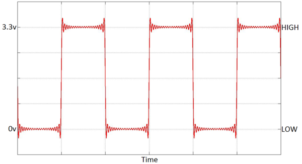

# Weather Station Basic I/O - Lesson Plan 1

This lesson will introduce students to weather forecasting and how it works, as well as some key weather terminology. Students will consider why gathering weather data is important and what data could be collected. They will be introduced to the Raspberry Pi weather station as a tool to automatically collect some of this data. The lesson will also introduce the use of Raspberry Pi GPIO pins to connect to measurement devices.

## Learning objectives

- Familarise students with some key weather terminology
- Identify weather characteristics that can be measured, and to understand how this is done
- Understand the potential use of the Raspberry Pi as an automated weather station
- Differentiate between the input and output modes of the GPIO interface, and the terms `HIGH` and `LOW`

## Learning outcomes

### All students are able to

- Understand why collecting data is essential to weather forecasting
- Suggest a property of the weather that could be measured
- Explain the difference between input and output

### Most students are able to

- Suggest appropriate methods or devices for capturing weather data
- Understand that digital devices only read and produce two states: `HIGH` and `LOW`

### Some students are able to

- Relate `HIGH` and `LOW` to other digital representations such as ON/OFF and 1/0
- Describe how the sensors might work and how they could connect to the `HIGH` and `LOW` signals

## Lesson Summary

- Decode a weather forecast
- Consider what data needs to be captured
- Introduce the Raspberry Pi and weather station sensors
- Understand the differences between input and output mode, and `HIGH` and `LOW` signals

## Starter

Begin by watching either video with the students. Afterwards, test them on the meaning of some key vocab, such as **high pressure**, **low pressure**, **fronts**, **isobars** and so on.
- [How To... Decode A Weather Forecast](https://www.youtube.com/watch?v=lITCF3UPVu4)
- [What are weather fronts](https://www.youtube.com/watch?v=G7Ewqm0YHUI)

Discuss with students how meteorologists make predictions about the weather. Through questioning, draw out the fact that they collect a huge amount of data to create [forecast models](http://en.wikipedia.org/wiki/Weather_forecasting#How_models_create_forecasts). Students could explore some models at [weatheronline.co.uk](http://www.weatheronline.co.uk/cgi-app/weathercharts?LANG=en&CONT=ukuk&MAPS=vtx) too.

## Main development

1. Ask students to consider the different weather data that could be measured, and how this might be collected. This could be done through general class discussion, playing with the sensors and predicting what they might do, or a simple [cardsort](files/WeatherStationCardsort.pdf) activity. Students could create a [weather log](files/weather_log.pdf) using a weather forecasting service to record the conditions predicted for the coming week. They could then find the nearest recording station on the [weather online](http://www.weatheronline.co.uk/weather/maps/current?LANG=en&CONT=ukuk) site and compare. This could be done as a home learning task.

1. Introduce the Raspberry Pi and how it will be used to automatically collect data. Students should consider and discuss in a group the benefits of the Raspberry Pi over a standard computer. These benefits include size, cost, and ability to interact with hardware sensors. If pupils have never used a Raspberry Pi, this [video](http://www.raspberrypi.org/help/what-is-a-raspberry-pi/) may be useful at this point. This [getting started lesson](http://www.raspberrypi.org/learning/getting-started-with-raspberry-pi-lesson/) may be useful in giving the students a hands-on experience.

1. Highlight the [General Purpose Input Output](../guides/GPIO/README.md) (GPIO) pins on the Raspberry Pi. Students should understand that the pins can be connected to **input** or **output** devices, and should be able to identify some simple examples of these. For each device, students should consider what it means when the voltage is `HIGH` or `LOW`. The [student worksheet](worksheet.md) has examples of different devices which students should identify as **input** or **output**. Students could also be given set of real devices (switches, LEDs, buzzers, PIR sensors, reed switches) and decide what each are and catagorise them as **input** or **output**.

## Plenary

Reiterate the meaning of `HIGH` and `LOW` by showing the voltage chart:

Discuss with the class the following questions:

  1. What would be happening if this graph was from the Output mode LED example?
  1. What would be happening if this graph was from the Input mode button example?

**Answers:**

  1. The LED is flashing on and off three times.
  1. Someone is pressing and releasing the button three times.

## Extension

- Students could consider how these digital signals might relate to the actual measurement of the weather. For instance, what do `HIGH` and `LOW` mean in relation to the rain gauge?
- Are there any sensors for which the `HIGH` and `LOW` readings aren't clear or don't work? For example, how does the weather vane work? In this case, what is `HIGH` and what is `LOW`? 
