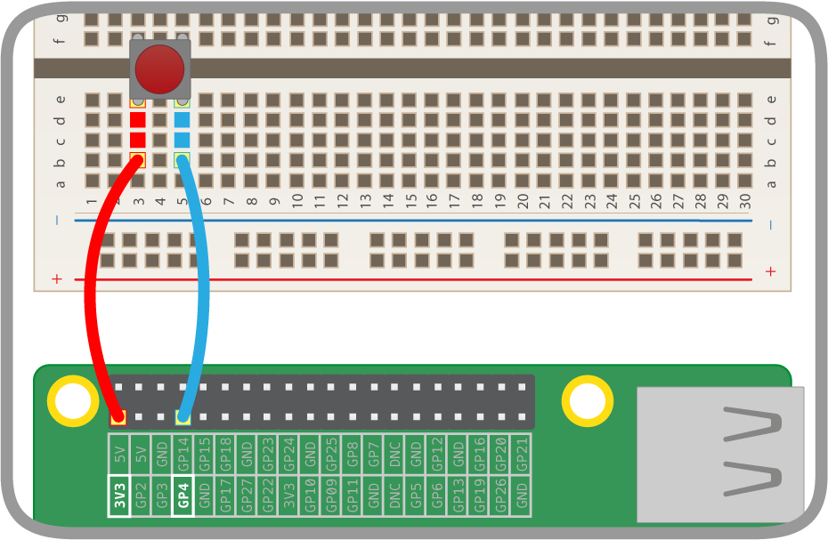

# Weather Station Basic I/O - Lesson Plan 2

In this lesson students will experiment with the Raspberry Pi GPIO pins and do some Python programming. We are going to focus on input mode specifically, since this is more appropriate to sensing things from the outside world than output mode. This knowledge will be used to connect with the rain gauge and wind speed sensors in later lessons.

## Learning objectives

- understand what pull up and pull down circuits are, and be able to differentiate between the two
- understand how to detect the state of a switch from within the Python programming language
- write a Python program which includes an infinite loop to check the state of the switch

## Learning outcomes

### All students are able to

  - Write a short piece of Python code to capture the input of a sensor
  - Use a `while` loop and pauses to repeat this capture of data

### Most students are able to

  - Write code to use both a **pull up** and **pull down** circuit
  - Be able to explain what each of these circuits do


### Some students are able to

  - Experiment with timings and decide how often to capture data from the sensor

## Lesson Summary

- Connect a basic switch and discuss pull up and pull down circuits
- Capture data from a GPIO pin using a pull up circuit
- Add a loop and timings
- Adapt to create a pull down circut
- Explore to get the timings right

## Starter

Connect a button to a demonstration Raspberry Pi. For effect, use a large red button. Run [this program on your Pi]() in Python 3. Invite students to guess what they think the button will do when they press it. After a few answers are given, ask students to think about what they might like a button to do if they connected one to a computer. Add suggestions to a whiteboard or spider diagram. Finally, invite a student to press the button to see what happens! 

## Main development

1. Lead a discussion with students exploring how buttons work. Explain the different ways in which an input signal can be detected by the Raspberry Pi. See the [Pull Up/Pull Down Guide](../guides/GPIO/pull_up_down.md) to help.
1. Demonstrate to students how to connect a button to the Raspberry Pi and using the [Pull Up/Pull Down Guide](../guides/GPIO/pull_up_down.md) ask students to connect their button either in pairs or on their own device.
1. Demonstrate to students how to create an empty program file called pullup.py by typing `sudo idle3 weather_station/pullup.py`
1. Guide the students through creating the following Python 3 program to detect the button press:

  ```python
  import RPi.GPIO as GPIO
  import time

  pin = 4

  GPIO.setmode(GPIO.BCM)
  GPIO.setup(pin, GPIO.IN, GPIO.PUD_UP

  pin_value = GPIO.input(pin)
  if pin_value == True:
      print ("HIGH")
  else:
      print("LOW")
  ```
  
  Students can use this [student worksheet](worksheet.md)

  ### Code explained:

  ```python
  import RPi.GPIO as GPIO
  import time
  ```
  This imports the `RPi.GPIO` library which allows you to control the GPIO pins, and the `time` library to measure time or make the program sleep.

  ```python
  pin = 4
  GPIO.setmode(GPIO.BCM)
  GPIO.setup(pin, GPIO.IN, GPIO.PUD_UP)
  ```
  These three lines set up a variable call pin to store the pin number. We then set the scheme for referring to our pins as the BCM scheme. The important bit is the third line, where we set up the pin as an input using a pull up resistor.

   ```python
   pin_value = GPIO.input(pin)
   ```
  This line reads the state of the pin and stores the result in a variable called `pin_value`. This will either be **True** or **False**.

    ```python
    if pin_value == True:
      print ("HIGH")
    else:
      print("LOW")
    ```
  These lines check the value of the `pin_value` variable, and will print out `HIGH` if the value is **True** and `LOW` if the value is **False**.

1. Discuss with the students any problems with this program that they can see. Draw out from their answers that the button can only be pressed once which is not particularly useful. Invite suggestions from the students on how this can be impreoved. It can be achieved through **polling** the pin every 0.5 seconds and constantly outputting the state.

1. Demonstrate to students how to add an infinite loop to the code. In Python 3, a **while True:** loop can be used. Remind students about the importance of indenting code. Change your program to put the last 4 lines inside a while loop and add a 0.5 second delay like this:

  ```python
  while True:
      if pin_value == True:
        print ("HIGH")
      else:
        print("LOW")
      time.sleep(0.5)
```
  When students run their code again by pressing `F5`; to exit the program and press `Ctrl + C`. They should see `HIGH` when the button isn't pressed and `LOW` when it is pressed.

1. Discuss with students what might still be problematic about the code. They are able to check the status of the input pin over and over but does it always work? Ask students to run the program again and press the button continuously. Set the challenge to see if they can press it fast enough that the Pi fails to detect some presses? The fact that the program only checks every 0.5 seconds means that some presses aren't detected. Ask students to adjust the timing of the program by changing the number in the line `time.sleep(0.5)` Ask students to think carefully about whether to increase this number or decrease it.

1. Demonstrate to students the difference between using a pull up resistor and a pull down resistor by changing the button wiring like this: 

  

  and by updating the code to use a pull down circuit rather than pull up: this is a single change on the line that reads `GPIO.setup(pin, GPIO.IN, GPIO.PUD_UP)` which should become `GPIO.setup(pin, GPIO.IN, GPIO.PUD_DOWN)`. The code should now look like [this](code/pulldown.py)

1. Ask students to add a loop to their code to make it poll continuously and report the status of the pin and adapt their program to use a Pull Down resistor setup instead of a Pull Up.

## Plenary

Display the table below to the class to recap. It is important to recognise that the pull up and pull down circuits give opposite values when the switch is open and closed. It can help if you first cover up the pull down column, and then cover up the pull up column instead.

Pull up | Switch | Pull down
:---:|:---:|:---:
HIGH | Open | LOW
HIGH | Open | LOW
HIGH | Open | LOW
HIGH | Open | LOW
LOW | Closed | HIGH
LOW | Closed | HIGH
LOW | Closed | HIGH
LOW | Closed | HIGH
HIGH | Open | LOW
HIGH | Open | LOW
HIGH | Open | LOW
HIGH | Open | LOW

Discuss the following with the class:

  1. Explain why the pull up shows those values.
  1. Explain why the pull down shows those values.
  1. We've learnt an important technique in this lesson which will allow us to interface with two of the weather station sensors. Which sensors we will use this for?

**Answers:**

  1. With a pull up circuit the GPIO pin is internally pulled up to 3.3 volts (via a programmable resistor) so that it always reads `HIGH`. When we close the switch we short the GPIO pin to ground, causing it to read `LOW`.
  1. With a pull down circuit the GPIO pin is internally pulled down to ground (via a programmable resistor) so that it always reads `LOW`. When we close the switch we short the GPIO pin to 3.3 volts, causing it to read `HIGH`.
  1.  The rain gauge and the anemometer (wind speed sensor).

## Extension

Students could consider the following ideas and questions:

- Is either one of these circuits better than the other? Does it make a difference which one we use?
- In our code we used a button to print a simple statement, but what else could you make it do?
- Could you connect multiple buttons to your Raspberry Pi and detect the states of each? Could you count the number of button presses?
