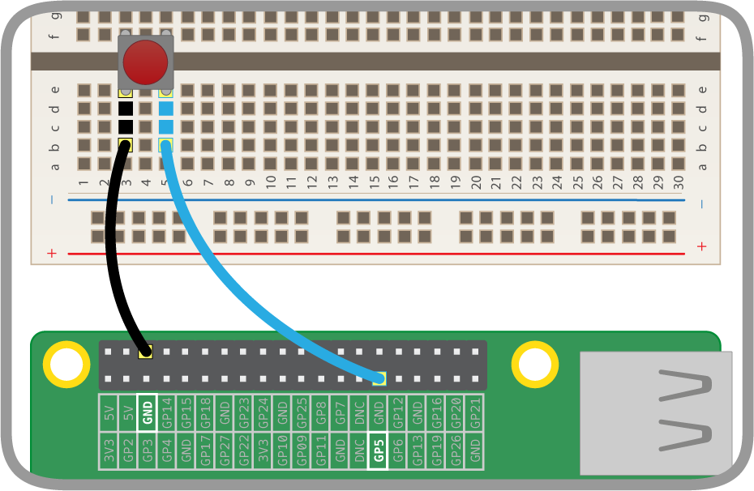

# Weather Station Basic I/O - Measuring Rainfall

In this lesson you will:

- Simulate a rain gauge and collect data using the Raspberry Pi GPIO pins
- Learn the difference between **continuous polling** and **interrupt handling**
- Convert the collected data into meaningful measurement information

## How does the rain gauge work?

Today you will be using the rain gauge sensor to collect data about rainfall. The gauge consists of a bucket to collect water, and a see-saw-like device to measure how much water passes through. Each time the bucket fills with a certain amount of water it tips, releasing the water and presenting the opposite bucket to be filled.

  

Each tip causes a magnet to pass in front a sensor called a reed switch, which closes the switch and triggers a `LOW` signal on the GPIO pins. This is exactly the same as using a button or pair of wires, as done in the previous lesson.

  

In order to calculate the amount of water that's passed through the gauge we need to know:

  - The amount of water needed to tip the bucket, in this case **0.2794** mm (this can be found on the [datasheet](https://www.argentdata.com/files/80422_datasheet.pdf)).
  - How many times the bucket has tipped, which can be counted as the number of input signals.

  **Rainfall = 0.2794 * number of tips**

## Getting Set Up

In order to get started we either need to set up a rain gauge, or simulate it, depending on the situation.

### You have a weather station & rain gauge to yourself

Connect the weather station board and rain gauge using the [guide](../guides/weather_station/rain_gauge.md)

### You don't have a weather station & rain gauge to yourself

In most classroom situations you won't have a rain gauge, or at least not one to yourself. In this case, you can simulate one using a pair of wires and a button.

1. Follow the [button guide](../guides/GPIO/connecting-button.md) to connect your wires up in a similar way to the previous lesson, except this time connect to pin 6.

	

1. Now you can simulate a bucket tip with a simple press of the button.

## Counting bucket tips

Set up your Raspberry Pi and ensure you are in desktop mode.

1. Launch the LXterminal window

  


1. Move to the `weather station` directory by typing `cd weather_station` and pressing `enter`

1. Copy the program to a new file called `rain_polling.py` using the command `cp pullup.py rain_polling.py` followed by `enter`.

1. Open you program by typing `sudo idle3 rain_polling.py`

1. In the top few lines change the pin being read to 6; the weather station is wired to use this pin so we should also use it for testing.

	 ```python
  	#!/usr/bin/python
  	import RPi.GPIO as GPIO
  	import time

  	pin = 6

  	GPIO.setmode(GPIO.BCM)
  	GPIO.setup(pin, GPIO.IN, GPIO.PUD_UP)
	 ```

1. We want to count the number of times the switch closes and drops the voltage from `HIGH` to `LOW`. In order to do this, we need to keep track of the **current state** of the pin, the **previous state**, and the signal **count**. To do this, create three variables and set them each to 0.

	```python
	current_state = 0
	previous_state = 0
	count = 0
	```

1. We will still want a `while True:` loop to constantly check the pin status, but we want to do something extra with it. In pseudocode (planning) our loop might look like this:


	> LOOP  
	> SET **CURRENT STATE** TO THE READING OF **INPUT PIN**  
	> IF **PREVIOUS STATE** = 1 AND THE **CURRENT STATE** = 0 THEN  
	> --- ADD 1 ONTO **COUNT**  
	> --- DISPLAY **RAINFALL**  
	> MOVE THE **CURRENT STATE** TO **PREVIOUS STATE**  
	> PAUSE 0.01 SECONDS  
	> END LOOP  


  In Python we would write:

	```python
	while True:
	       current_state = GPIO.input(pin)

	        if previous_state == GPIO.HIGH and current_state == GPIO.LOW:
	            count=count + 1
	            print (count * 0.2794)

			previous_state = current_state
	```

  You can see the complete code [here](code/rain_polling.py).

1. Once you have entered your code, run it by presing **F5**.
1. If you press your button a few times, your program should display something like:

    ```
    0.2794
    0.5588
    0.8382
    ```

1. You can quit at any time with the keystroke `CTRL + C`.

## Using interrupts in place of polling

So far we have used polling to repeatedly check the status of the input pin, which is very inefficient. The code constantly checks for rainfall every 0.01 seconds, which uses some processing power. Wouldn't it be better if the system only checked for rainfall when it was raining, and ignored the rain gauge the rest of the time?

To do that we need to use a technique called interrupt handling. Rather than constantly check the status of the pin, we use a mechanism called an interrupt to trigger a function.

1. From your rain_polling.py program in IDLE click the **file** menu and select **save as**, replace the file name with `rain_interrupt.py`

1. We need to make a few changes to the code: firstly, you should remove the variables **current_state** and **previous_state** as we won't need them.

1. Now, the code to increment the count and display the current rainfall needs to be moved into a function (a reusable section of code). You should call the function something sensible as you will need the name for the next step. We've called ours `bucket_tipped`. Here's what the first section of the code looks like now:

    ```python
    #!/usr/bin/python3
    import RPi.GPIO as GPIO

    pin = 6
    count = 0

    def bucket_tipped(channel):
        global count
        count = count + 1
        print(count * 0.2794)

        GPIO.setmode(GPIO.BCM)
        GPIO.setup(pin, GPIO.IN, GPIO.PUD_UP)
    ```

1. In order for your function to be triggered when the input voltage on pin 6 drops, you will need to define an interrupt event. Add this line to your code:

    ```python
    GPIO.add_event_detect(pin, GPIO.FALLING, callback=bucket_tipped, bouncetime=300)
	```

    This line sets up the interrupt event on the `pin` and waits for a `GPIO.FALLING` event. When detected, it calls the `bucket_tipped` function. The `bouncetime=300` parameter specifies the minimum time, in milliseconds, between two events being detected.

1. Finally, we need a line to keep the program running, otherwise it will finish before any rain is detected. For now we'll get it to wait for the user to press `Enter`, and then exit.

    ```python
    input("Press Enter to stop logging\n")
	```

    The complete code can be found [here](code/rain_interrupt.py)

1. Run your code by pressing **F5**, this will ask you to save your code.
2. As you press your button you should see:

	```
	Press Enter to stop logging
	0.2794
	0.5588
	0.8382
	1.1176
	```
## Summary

You should now have a working rain gauge using two different approaches. Consider the following questions:

- What is the difference between polling and interrupt handling?
- Is one of these techniques better? If so, why?
- Why is the unit of measurement for the gauge **mm** rather than **ml**?

## What's next

Now that you have built your rain gauge code you should test its accuracy. How much water would 1mm be in the top of the bucket?
