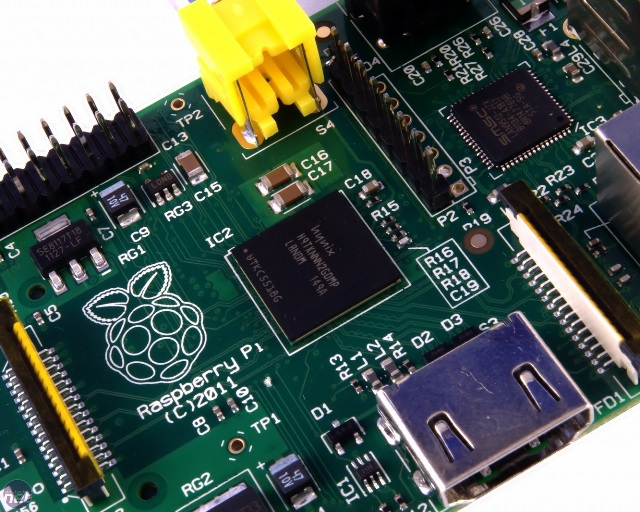

# Temperature Log

The BCM2835 system on a chip (SoC) of the Raspberry Pi has a temperature sensor that can be used to measure its temperature from the command line. It can provide information on how much heat the chip has generated during operation and also report on the temperature of the environment. This project's aim is to create a simple shell script that can run automatically as you boot up your Raspberry Pi, take measurements from the temperature sensor at given intervals, and write them into log files that can be viewed later.

## Requirements

### Hardware

For accurate timestamps in your logs, you can use an optional [Real Time Clock](http://www.modmypi.com/raspberry-pi/breakout-boards/raspberry-pi-%28official%29/piface-shim-rtc-real-time-clock/) accessory

## Worksheet & included files

- [The worksheet](worksheet.md)

- (Optional) There is also a shell script version of the temperature monitor, if you prefer using Bash: [temp_monitor.sh](code/temperature_log.sh)
    - Download to your Pi with `wget http://goo.gl/vV2SF5 -O temperature_log.sh --no-check-certificate`

## Licence

Unless otherwise specified, everything in this repository is covered by the following licence:

***Temperature Log*** by the [Raspberry Pi Foundation](http://www.raspberrypi.org) is licensed under a [Creative Commons Attribution 4.0 International Licence](http://creativecommons.org/licenses/by-sa/4.0/).

Based on a work at https://github.com/raspberrypilearning/temperature-log
