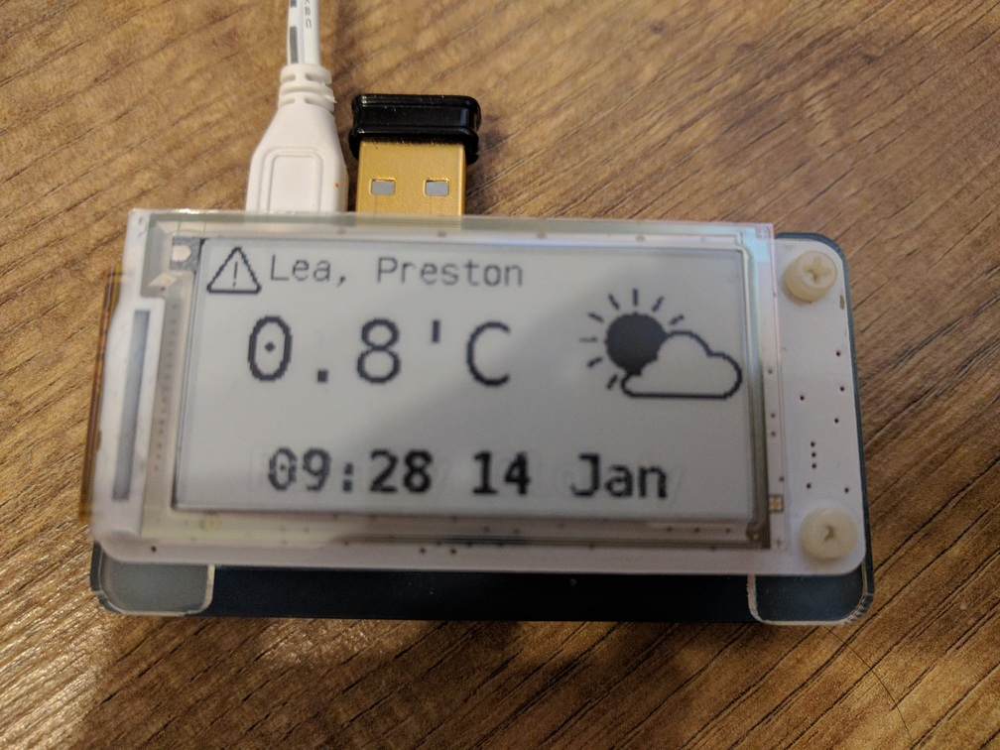
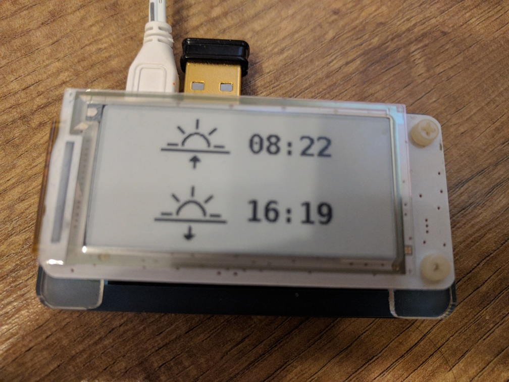
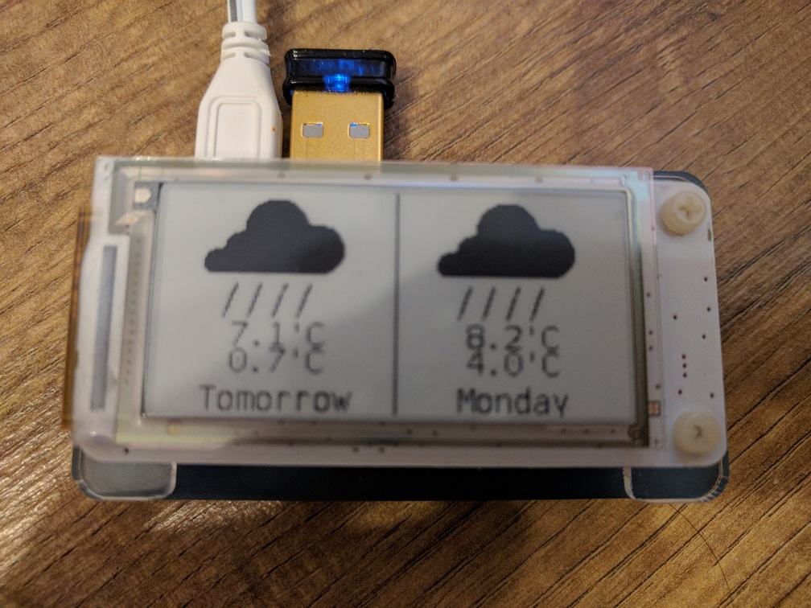
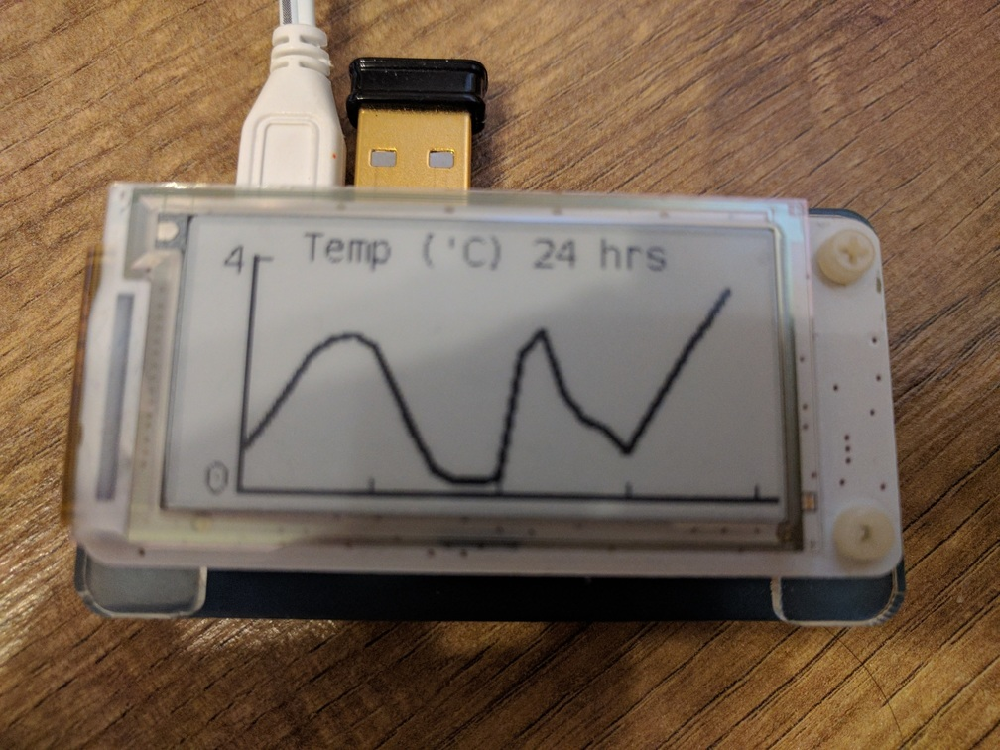
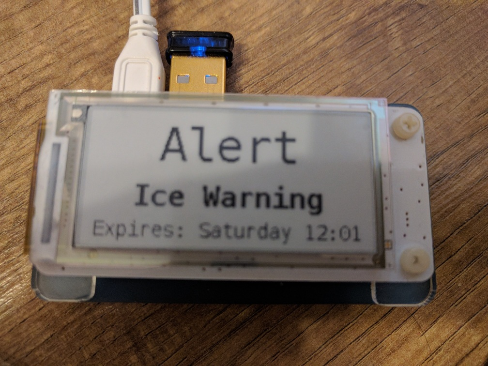

# pihat_weather
This repository contains the code for displaying the weather forecast on two Raspberry Pi Zero phats: the Scroll pHat and the PaPiRus Zero.

## PaPiRus Zero

```weather_eink.py``` displays weather information. 
The main screen shows alert status (if any), location, temperature, current condition icon , and summary of current conditions or time and date.  

There are 5 buttons that show secondary screens of information for 10 seconds before restoring the main display.
Button 1 (far left) shows sunrise and sunset information.  
  
Button 2 shows the forecast for the next two days.  
  
Button 3 shows a graph of the temperature for the next 24 hours. The dotted line indicates 0'C.  
  
Button 4 shows any current weather warning information.  
  
Button 5 is current not in use. 


## Scroll pHat

```weather_led.py``` scrolls the time, temperature and weather summary across the pHat. The weather updates every 5 minutes using https://darksky.net/ as a data source.

